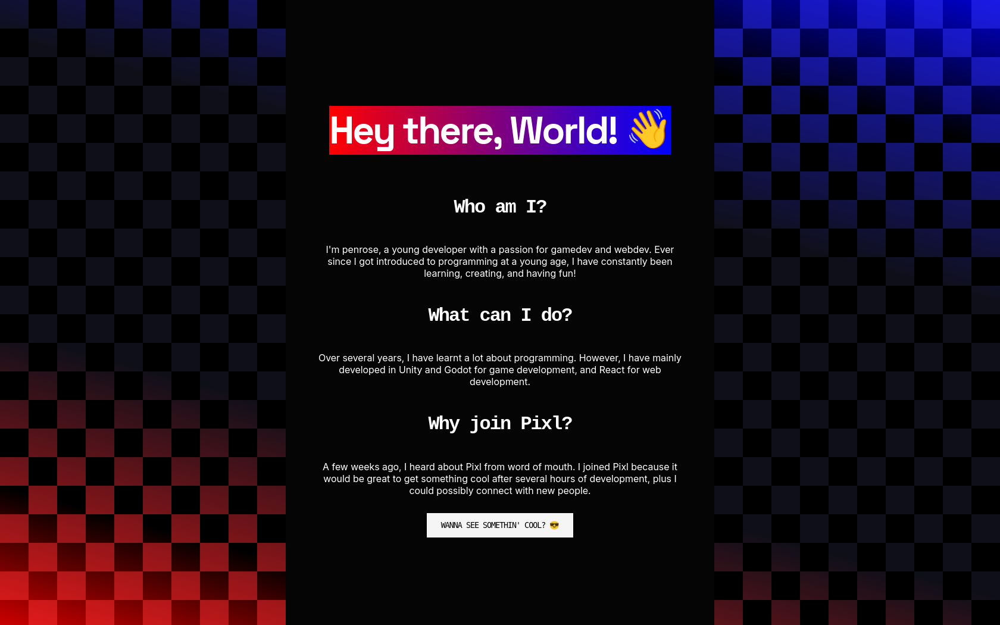

# Simple-Website
Basic website written in Vanilla HTML and CSS

## Features
- Basic informative text layout
- Cool checkerboard and gradient background
- Alternative page that provides user choice
- Stores user disappointment in local storage
- Sets homepage button based on user disappointment

Made in Vanilla HTML, CSS, and Javascript